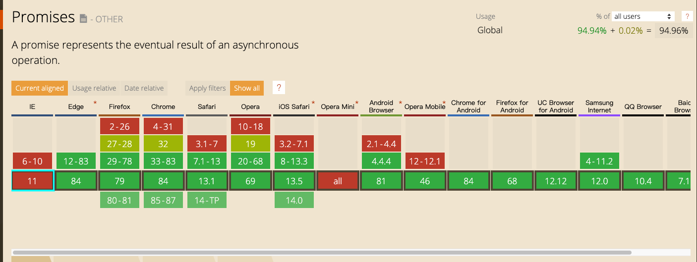

### Promise

解决传统方案`回调函数和事件`一个新的异步编程解决方案,目前原生`Promise`已经支持大部分浏览器

<br/>

<br/>

目前`Promise`实现都是遵循`Promises/A+规范`

- [英文文档](https://promisesaplus.com/)
- [中文文档](https://www.ituring.com.cn/article/66566)

### Promise 特点

- `Promise`内部有三种状态 `等待态（Pending）`、`执行态（Fulfilled）`、`拒绝态（Rejected）`，三种状态转换关系如下:

  - `等待态（Pending）`可以迁移至`执行态（Fulfilled）`和 `拒绝态（Rejected）`
  - `执行态（Fulfilled）`不能迁移至其他任何状态,必须拥有一个不可变的值（指任何 JavaScript 的合法值）
  - `拒绝态（Rejected）`不能迁移至其他任何状态,必须拥有一个不可变的拒绝值（一个 promise 的拒绝原因）

- `Promise`内部必须实现`then`方法,来获取当前值和拒绝值,并且`then`方法必须返回一个新的`Promise`对象，需要接受两个函数作为参数`onFulfilled`和`onRejected`

  - `onFulfilled`和`onRejected`如果不是函数值会被忽略
  - `onFulfilled`是函数:

    - 当`promise`执行结束后其必须被调用，其第一个参数为`promise`的终值
    - 在`promise`执行结束前其不可被调用
    - 其调用次数不可超过一次
    - 必须作为函数调用并且异步执行

  - `onRejected`是函数:

    - 当`promise`拒绝执行结束后其必须被调用，其第一个参数为`promise`的拒绝值
    - 在`promise`拒绝执行结束前其不可被调用
    - 其调用次数不可超过一次
    - 必须作为函数调用并且异步执行

### Promise 基础用法

```javascript
new Promise((resolve, reject) => {
  setTimeout(() => {
    if(/*成功*/) {
        resolve(1)
    }else {
       reject(2)
    }
  }, 1000)
}).then(
  (data) => {
    // 调用resolve执行
    console.log(data) // 1
  },
  (err) => {
    // 调用reject执行
    console.log(err) // 2
  }
)
```

### 实现 Promise

按照`Promises/A+规范`自己动手实现`Promise`,结合规范一步步去实现

- 定义一个`Promise`构造函数,接受一个函数作为参数,并且该函数立即执行

```typescript
class XaPromise<T> {
  constructor(executor: Executor<T>) {
    this.initExecutor(executor)
  }
  private initExecutor(executor: Executor<T>) {
    try {
      executor(
        (value) => {
          this.resolve(value)
        },
        (reason) => {
          this.reject(reason)
        }
      )
    } catch (e) {
      this.reject(e)
    }
  }
}
```

```typescript
new XaPromise((resolve, reject) => {})
```

- `Promise`内部有三种状态 `等待态（Pending）`、`执行态（Fulfilled）`、`拒绝态（Rejected）`默认为`Pending`

```typescript
type statusType = 'pending' | 'fulfilled' | 'rejected'

class XaPromise<T> {
  ['[[PromiseStatus]]']: statusType = 'pending'
}
```

- `Promise`内部必须实现`then`方法,并且`then`方法必须返回一个新的`Promise`对象

```typescript
type statusType = 'pending' | 'fulfilled' | 'rejected'

class XaPromise<T> {
  then(onResolve: any, onReject?: any): XaPromise<T> {
    return new XaPromise((resolve, reject) => {})
  }
}
```

- `Promise`对象`then`方法处理过程

```typescript
class XaPromise<T> {
  then(onResolve: any, onReject?: any): XaPromise<T> {
    let newXaPromise: any
    // then 方法必须返回一个 promise 对象
    return (newXaPromise = new XaPromise((resolve, reject) => {
      let status = this.getPromiseStatus()
      if (status === 'pending') {
        this.callbacks.push({
          resolve() {
            try {
              // 如果 onFulfilled 或者 onRejected 返回一个值 x ，则运行下面的 Promise 解决过程：[[Resolve]](promise2, x)
              let x = onResolve(this.getPromiseValue())
              // 不论 promise1 被 reject 还是被 resolve 时 promise2 都会被 resolve，只有出现异常时才会被 rejected
              this.handlerResolvePromise(newXaPromise, x, resolve, reject)
            } catch (e) {
              // 如果 onFulfilled 或者 onRejected 抛出一个异常 e ，则 promise2 必须拒绝执行，并返回拒因 e
              reject(e)
            }
          },
          reject() {},
        })
      }
      // 省略部分代码
    }))
  }

  private handlerResolvePromise(newXaPromise: T, x: any, resolve: any, reject: any) {}
}
```

- `Promise`解决过程`[[Resolve]](promise2, x)`

  - `x`与`Promise`相等
    - 如果`promise`和`x`指向同一对象，以`TypeError`拒绝执行`promise`

  ```typescript
    private handlerResolvePromise(newXaPromise: T, x: any, resolve: any, reject: any) {
        if (x === newXaPromise) {
            return reject(new TypeError('resolve不能传入当前then返回的Promise对象'))
        }
    }
  ```

  - `x`为`Promise`
    - 如果`x`处于等待态，`promise`需保持为等待态直至`x`被执行或拒绝
    - 如果`x`处于执行态，用相同的值执行`promise`
    - 如果`x`处于拒绝态，用相同的据因拒绝`promise`

  ```typescript
    private handlerResolvePromise(newXaPromise: T, x: any, resolve: any, reject: any) {
       if (x instanceof XaPromise) {
            // 如果 x 处于等待态， promise 需保持为等待态直至 x 被执行或拒绝
            if (x['[[PromiseStatus]]'] === 'pending') {
                x.then(
                    (_value: any) => {
                        this.handlerResolvePromise(newXaPromise, _value, resolve, reject)
                    },
                    (_reason: any) => {
                        reject(_reason)
                    }
                )
            } else {
                // 如果 x 处于执行态，用相同的值执行 promise
                // 如果 x 处于拒绝态，用相同的据因拒绝 promise
                x.then(resolve, reject)
            }
        }
    }
  ```

  - `x`为对象或函数
    - 把`x.then`赋值给`then`
    - 如果取`x.then`的值时抛出错误`e` ，则以`e`为据因拒绝`promise`
    - 如果`then`是函数，将`x`作为函数的作用域`this`调用，传递两个回调函数作为参数，第一个参数叫做 `resolvePromise` ，第二个参数叫做`rejectPromise`

        - 如果`resolvePromise`以值`y`为参数被调用，则运行`[[Resolve]](promise, y)`
        - 如果`rejectPromise`以据因`r`为参数被调用，则以据因`r`拒绝 `promise`
        - 如果`resolvePromise`和`rejectPromise`均被调用，或者被同一参数调用了多次，则优先采用首次调用并忽略剩下的调用
        - 如果调用`then`方法抛出了异常`e`
    - 如果`then`不是函数，以`x`为参数执行`promise`

  - 如果`x`不为对象或者函数，以`x`为参数执行`promise`  

  ```typescript
    private handlerResolvePromise(newXaPromise: T, x: any, resolve: any, reject: any) {
        let flag = false 
        if (typeof x === 'function' || (x !== null && typeof x === 'object')) {
            try {
                // x 为对象或函数
                // 把 x.then 赋值给 then
                // 如果取 x.then 的值时抛出错误 e ，则以 e 为据因拒绝 promise
                let then = x.then
                // 如果 then 是函数，将 x 作为函数的作用域 this 调用之。传递两个回调函数作为参数，第一个参数叫做 resolvePromise ，第二个参数叫做 rejectPromise
                if (typeof then === 'function') {
                    then.call(
                        x,
                        (y: any) => {
                            // 如果 resolvePromise 以值 y 为参数被调用，则运行 [[Resolve]](promise, y)
                            // 如果 resolvePromise 和 rejectPromise 均被调用，或者被同一参数调用了多次，则优先采用首次调用并忽略剩下的调用
                            if (flag) return
                            flag = true
                            this.handlerResolvePromise(newXaPromise, y, resolve, reject)
                        },

                        (r: any) => {
                            // 如果 rejectPromise 以据因 r 为参数被调用，则以据因 r 拒绝 promise
                            // 如果 resolvePromise 和 rejectPromise 均被调用，或者被同一参数调用了多次，则优先采用首次调用并忽略剩下的调用
                            if (flag) return
                            flag = true
                            reject(r)
                        }
                    )
                } else {
                    // 如果 then 不是函数，以 x 为参数执行 promise
                    reject(x)
                }
            } catch (e) {
                // 如果 resolvePromise 或 rejectPromise 已经被调用，则忽略之
                if (flag) return
                flag = true
                reject(e)
            }
        }
    }
  ```


[XaPromise源码地址](./promise.ts)